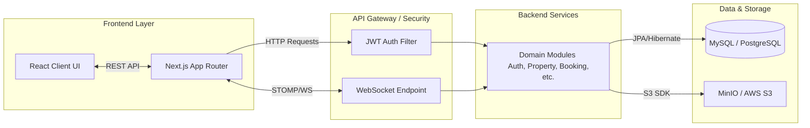
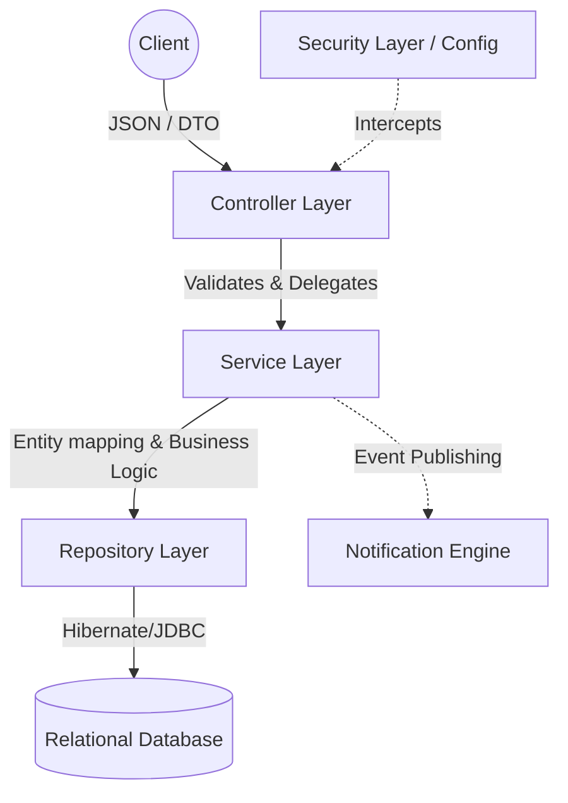
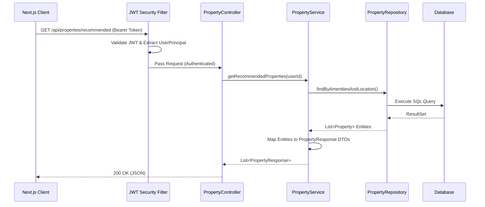
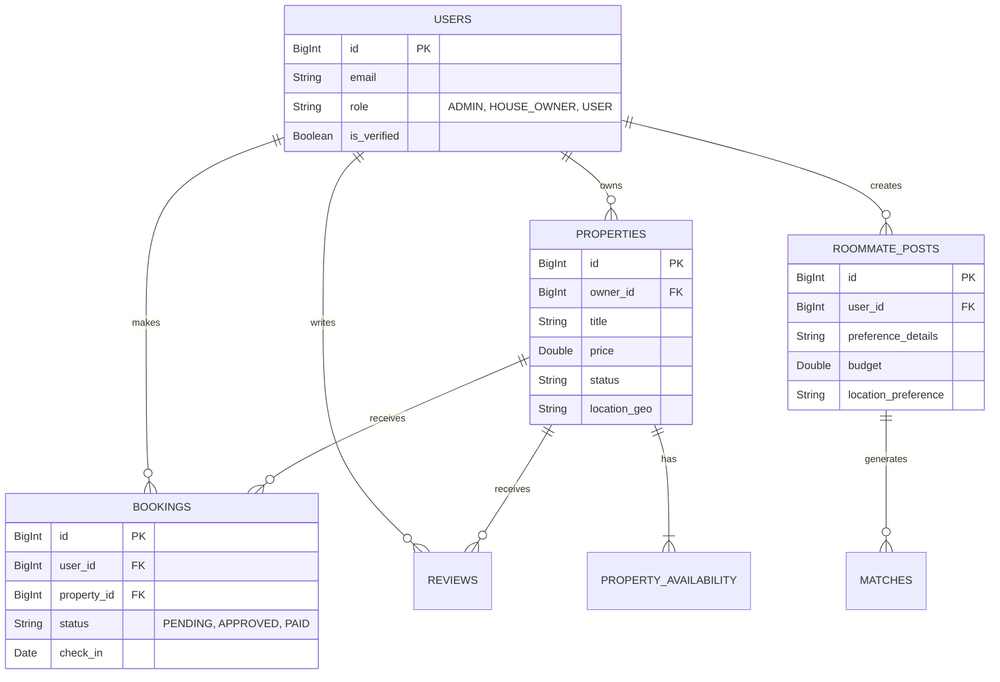
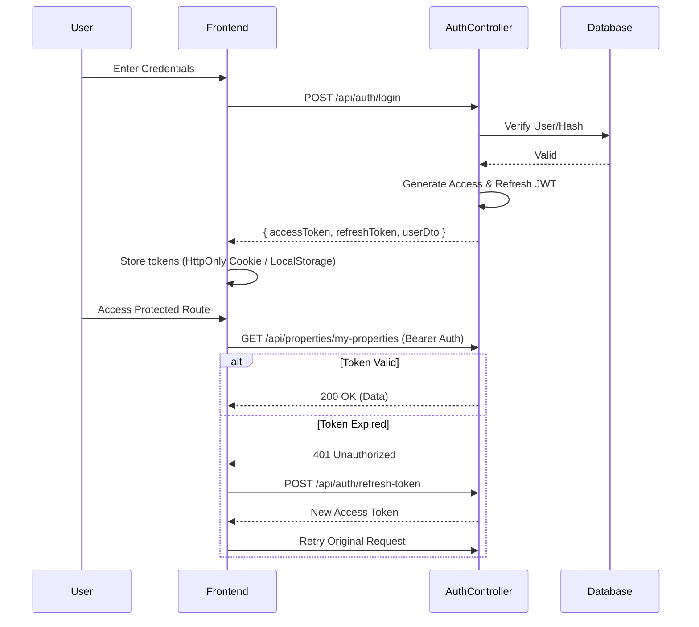

# StayMate

<div align="center">
  <h3>A Modern Real Estate & Roommate Matching Platform</h3>
</div>

---

## 1. Project Description

**StayMate** is a comprehensive, full-stack real estate and roommate matching platform designed to simplify the housing search process. It connects property owners with tenants and helps individuals find compatible roommates through an intuitive, dynamic interface.

**Problem it solves:** The traditional process of finding a place to rent or a reliable roommate is fragmented, often requiring multiple platforms for communication, property verification, and payments.
**Real-world use case:** A university student looking for a shared apartment can use StayMate to find a verified roommate with similar preferences, and together they can book a verified property directly through the platform.
**Target users:** Students, young professionals, property owners, and property managers.
**Core functionality:** Property listings with advanced search and map integration, structured roommate matching, secure booking management, real-time messaging, and comprehensive role-based dashboards (Admin, House Owner, Tenant).

---

## 2. Features

* **Advanced Authentication & Authorization:** Multi-role support (Admin, House Owner, User/Tenant) using JWT and Google OAuth2 integration.
* **Property Management (CRUD):** Owners can list properties, manage availability, upload media (via MinIO/S3), and define amenities.
* **Roommate Matching System:** Users can create structured roommate posts detailing lifestyle preferences, enabling optimized matching.
* **Comprehensive Booking Engine:** Manages the entire lifecycle of a rental application, from inquiry to confirmed booking for both entire properties and individual seats/rooms.
* **Real-time Engine:** Integrated WebSockets (StompJS/SockJS) for real-time messaging between users and instant notifications.
* **Verification System:** Trust and safety mechanisms allowing users and properties to be verified via document uploads.
* **Review & Rating System:** Two-way feedback system for properties and users to maintain platform quality.
* **Analytics Dashboards:** Role-specific dashboards providing insights into earnings, active bookings, matches, and platform growth.
* **AI Integration:** Features an AI module for intelligent recommendations and automated support responses.
* **Robust Admin Capabilities:** System-wide monitoring, user management, support ticket resolution, and audit logging.

---

## 3. Tech Stack

**Backend**
* **Java 17** & **Spring Boot 3.2.0**
* **Spring Security** (JWT + OAuth2 Client)
* **Spring Data JPA** & **Hibernate**
* **Spring WebSockets** (Real-time Sync)
* **Flyway** (Database Migrations)
* **OpenAPI/Swagger** (API Documentation)
* **AWS SDK / MinIO** (Object Storage)
* **Twilio** (SMS/OTP Services)
* **OpenPDF** (Automated Report Generation)

**Frontend**
* **Next.js 14** (App Router)
* **React 18** & **TypeScript**
* **Tailwind CSS** & **Framer Motion** (Styling & Micro-animations)
* **React Hook Form** & **Zod** (Form Validation)
* **Leaflet / React-Leaflet** (Map Integrations)
* **StompJS / SockJS Client** (WebSocket Communication)

**Database**
* **MySQL 8.0** (Local Development)
* **PostgreSQL** (Production / Supabase)

**DevOps & Deployment**
* **Docker & Docker Compose** (Containerization & Local Dev)
* **Render** (Backend Hosting)
* **Supabase** (Managed Database)
* **Vercel** (Frontend Hosting)
* **Shell Scripts** for CI/CD operations

---

## 4. Project Architecture Explanation

StayMate uses a **Monolithic Layered Architecture** structured around **Domain-Driven Design (Package-by-Feature)** principles on the backend, paired with a decouple **Single Page Application (Next.js)** frontend.

* **Architecture Style:** Domain-Driven Monolith communicating via RESTful APIs and WebSockets.
* **Component Responsibilities:**
  * **Frontend (Next.js App Router):** Handles UI rendering, client-side routing, state management, and real-time updates.
  * **Controllers (Spring MVC):** Expose REST endpoints, handle HTTP requests, and validate inputs using DTOs.
  * **Services (Spring Service):** Contain core business logic, orchestration of multiple repositories, and transaction management (`@Transactional`).
  * **Repositories (Spring Data JPA):** Manage database interactions and complex queries.
  * **Security Filter Chain:** Intercepts requests to validate JWT tokens and enforce Role-Based Access Control (RBAC).
* **Data Flow:** The client sends secured JSON payloads. The Controller validates the request and maps it to a Domain Service. The Service applies business rules, interacts with the Repository, and maps Entities back to Response DTOs before returning them to the Controller.

---

## 5. Folder Structure Explanation

```text
StayMate/
├── frontend/                     # Next.js Application
│   ├── src/
│   │   ├── app/                  # Route components (App Router)
│   │   │   ├── dashboard/        # Role-based dashboard UI
│   │   │   ├── properties/       # Property listing pages
│   │   │   └── ...
│   │   ├── components/           # Reusable UI components (Tailwind/Framer)
│   │   ├── hooks/                # Custom React hooks
│   │   ├── lib/                  # Utilities, API Axios instances
│   │   └── types/                # TypeScript interfaces
├── server/                       # Spring Boot Application
│   ├── src/
│   │   ├── main/
│   │   │   ├── java/com/webapp/
│   │   │   │   ├── auth/         # Security, JWT filters, Auth controllers
│   │   │   │   ├── config/       # Global configurations (CORS, WebSocket, S3)
│   │   │   │   └── domain/       # Package-by-Feature architecture
│   │   │   │       ├── property/ # Property APIs, Services, Entities
│   │   │   │       ├── user/     # User lifecycle management
│   │   │   │       ├── booking/  # Application and booking system
│   │   │   │       ├── roommate/ # Roommate matching engine
│   │   │   │       └── ...       # (messaging, admin, finance, etc.)
│   │   │   └── resources/
│   │   │       ├── db/migration/ # Flyway SQL migration scripts
│   │   │       └── application*.properties # Env-specific configs
├── docker-compose.yml            # Local orchestration (MySQL, MinIO, App)
└── .env.example                  # Environment variable reference
```

**Why this structure?** Grouping by feature (`domain/property`, `domain/booking`) rather than layer ensures high cohesion. When a developer works on "Bookings," all relevant controllers, services, entities, and DTOs are in one modular folder.

---

## 6. System Architecture Diagram


*The Next.js frontend interacts with the Spring Boot backend via secure REST calls and WebSocket streams. The backend enforces security, processes business logic within feature domains, and persists data into the SQL database and object storage.*

---

## 7. Backend Layered Architecture Diagram



---

## 8. Request Lifecycle Diagram


*Step-by-step:* The client attaches a JWT Token. Spring Security's filter validates the token to extract the user context. The Controller receives the request, delegates the business task to the Service, which triggers database operations via the Repository. Entities are converted to DTOs before being serialized to JSON.

---

## 9. Database Design

*The following ER diagram highlights core platform entities and their relations, detected directly from Flyway migrations and domain models.*


* *Users* are the central entity. They can take on different roles deciding their relation to properties and posts.
* *Properties* hold availability vectors and are the targets for Bookings and Reviews.
* *Roommate Posts* exist to generate Matches between compatible users.

---

## 10. API Documentation

| Endpoint | Method | Description | Request Body Example / Params | Target Role |
| -------- | ------ | ----------- | ------------ | -------- |
| `/api/auth/register` | `POST` | Create a new account | `{ email, password, name }` | Public |
| `/api/auth/login` | `POST` | Authenticate and get JWT | `{ email, password }` | Public |
| `/api/auth/refresh-token`| `POST` | Refresh expired JWT | `{ refreshToken }` | Public |
| `/api/properties` | `POST` | Create a new property | `FormData: { data (JSON), files }` | HOUSE_OWNER |
| `/api/properties/search` | `GET` | Search with filters | `?query=X&minPrice=Y&minBeds=Z` | Any User |
| `/api/properties/{id}` | `GET` | Get property details | Path Variable: `id` | Any User |
| `/api/bookings` | `POST` | Submit a booking application| `{ propertyId, checkIn, checkOut }` | USER |
| `/api/roommates/posts`| `POST` | Create a roommate search post | `{ budget, location, preferences }` | USER |
| `/api/messages/ws` | `WS` | Connect to real-time chat | WebSocket Handshake | Authenticated |

---

## 11. Authentication Flow

StayMate implements a stateless JWT-based authentication flow with refresh tokens.



---

## 12. Environment Variables

Create `.env` based on the provided `.env.example`:

```env
# Database Configuration
DB_HOST=localhost
DB_PORT=3306
DB_NAME=staymate
DB_USERNAME=root
DB_PASSWORD=your_secure_password_here

# JWT Configuration
JWT_SECRET=your_base64_encoded_random_secret_here

# Google OAuth2
GOOGLE_CLIENT_ID=your_client_id
GOOGLE_CLIENT_SECRET=your_client_secret
OAUTH2_REDIRECT_URI=http://localhost:3000/oauth2/redirect

# Frontend Configuration
NEXT_PUBLIC_API_URL=http://localhost:8080
BACKEND_URL=http://server:8080

# File Storage Configuration (Local MinIO)
MINIO_URL=http://localhost:9000
MINIO_PUBLIC_URL=http://localhost:9005
MINIO_ROOT_USER=minioadmin
MINIO_ROOT_PASSWORD=minioadmin
```

---

## 13. How to Run Locally

**Prerequisites:** Docker, Docker Compose, Node.js (v18+). Java 17/Maven (optional if skipping Docker for backend).

1. **Clone the repository.**
2. **Setup Environment Variables:** Copy `.env.example` to `.env` in the root directory and populate variables.
3. **Start the Infrastructure using Docker Compose:**
   ```bash
   # Starts MySQL, MinIO (S3 mock), Spring Boot Backend, and Next.js Frontend
   docker-compose up -d
   ```
4. **Access Applications:**
   * Frontend: `http://localhost:3000`
   * Backend API: `http://localhost:8080`
   * MinIO Console: `http://localhost:9001` (Credentials: minioadmin/minioadmin)

*Note: Flyway migrations will automatically structure and seed the database on container start.*

---

## 14. Build & Deployment

StayMate is structured for cloud-native deployment:

* **Backend (Render / AWS ECS):** Connect the `server` directory to your CI provider. Ensure environment variables target your production database. A custom `deploy-aws.sh` and Terraform setup exist for sophisticated AWS ECS rollouts.
* **Database (Supabase / AWS RDS):** Production utilizes PostgreSQL. `server/pom.xml` includes PostgreSQL drivers. Ensure `application-prod.yml` leverages `jdbc:postgresql://`. Flyway handles schema deployment.
* **Frontend (Vercel / AWS Amplify):** Deploy the `frontend` folder directly to Vercel. Set `NEXT_PUBLIC_API_URL` to the deployed backend domain.

---

## 15. Project Workflow Explanation

To understand how StayMate functions end-to-end, consider the **Booking Lifecycle Event Loop**:

1. **Creation:** A *House Owner* accesses their dashboard and creates a property listing (Files upload to S3, data to SQL).
2. **Discovery:** A *Tenant* browses properties using advanced filters (handled dynamically by Spring Data JPA Specifications).
3. **Initiation:** Tenant initiates a Chat WebSocket session to ask questions before submitting a booking request.
4. **Application Logic:** Tenant sends a POST to `/api/bookings`. The system asserts availability constraints. A pending Booking Entity is created.
5. **Notification:** The `NotificationService` intercepts the booking creation event and sends an in-app push and/or email to the House Owner.
6. **Execution:** House owner approves from the Dashboard. Status updates to `APPROVED`. Tenant pays, changing status to `PAID`.

---

## 16. Future Improvements (Architecture Enhancements)

While the current modular monolith is highly effective, scaling the business may warrant:

* **Microservices Extraction:** If the "Messaging" or "Matching Engine" requires separate scaling rules from core CRUD operations, extract them into discrete services communicating via API Gateway.
* **Elasticsearch/Typesense Integration:** The current relational search works for early scaling. Introduce a dedicated search appliance indexed from the DB via Kafka events to support geospatial search at scale and fuzzy text matching.
* **Redis Caching Layer:** Implement `@Cacheable` on high-read endpoints like `/api/properties/recommended` using Redis to greatly reduce database load.
* **Event-Driven Asynchronous Processing:** Shift from synchronous service calls when generating notifications and audit logs to using an event broker (RabbitMQ or Apache Kafka) to decrease endpoint latency.
